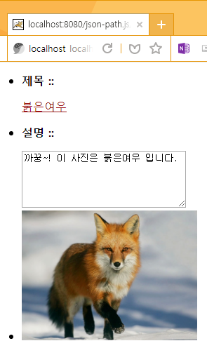

이 라이브러리는 프론트엔드에서 JSON와 뷰를 연결하기 위한 실험적 경량 라이브러리 입니다.

**HTML 코드**

```html
<div id="jsonBindArea">
   <ul>
         <li>
            <p style="font-weight:bold">제목 ::</p>
            <p data-json-path="entry/title" style="text-decoration:underline;color:rgb(155, 23, 23)"></p>
         </li>
         <li>
            <p style="font-weight:bold">설명 ::</p>
            <textarea data-json-path="entry/alt" cols="50" rows="5"></textarea>
         </li>
         <li>
            
         </li>
   </ul>
   </div>      
```
이 HTML 소스코드에서 몇가지를 눈 여겨 보면 다음과 같습니다.  
첫번째 부분은 id 값을 'jsonBindArea' 로 지정한 컨테이너(DIV태그)   
두번째로 data-json-path 속성이 삽입된 자식 요소들 입니다.   
해당 태그에 나타낼 값을 data-json-path 속성에서 JSON객체의 구조를 PATH로 접근하여 가져오도록 합니다.  
즉, 특정 컨네이너 영역의 자식 요소들에 설정한 data-json-path 속성를 통해   해당 자식 요소에 특정 JSON객체 정보를 출력 하도록 합니다.

 **스크립트 코드** 

```js
<script src='js/json-path.js'></script>
<script>            
   jQuery(function($){
         $.get( "data.json", function( data) {
            jsonTemplate("jsonBindArea",data);
         });
   });
</script>
```
이 스크립트는 AJAX를 이용해 JSON 객체에 접근하여 응답결과 받아옵니다.  
그리고 스크립트 파일인 json-path.js을 삽입하면 jsonTemplate 함수를 사용할 수 있습니다.  

jsonTemplate 함수를 사용하는 방법은 아래와 같습니다.  
```js
jsonTemplate("컨테이너ID",컨테이너에 매칭되는 또는 자식요소에 표현할 객체정보가 단긴 JSON데이터)
```

 **실행결과** 
  


